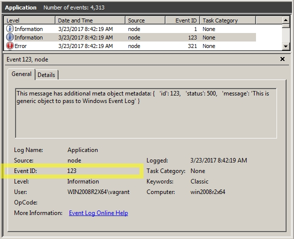

# winston-winlog3

Fork of `winston-winlog2`

Added:
- ability to set `Event Id` using `id` field of `meta` parameter (with range check)
- fixed double quotes handling

```js
var winston = require('winston'),
    winlog = require('winston-winlog3');
    //winlog = require('../../');

winston.add(winlog, { source: 'node' });

winston.info('this is an info message',    { id: 1   });
winston.warn('this is an warning message', { id: 123 });
winston.error('this is an error message',  { id: 321 });
```



____

# Original README.md with minor changes


Windows Event Log logger for the node.js Winston module.

Exactly like the original `winston-winlog`, however uses `coreybutler/node-windows` instead of `jfromaniello/windowseventlogjs` so no native compiling using `node-gyp` is required. Also automatically pops up a UAC box if admin permissions are required.

## Installation

    $ npm install winston-winlog3
    $ npm install winston


## Usage

Configure :

```js
  var winston = require('winston'),
      winlog = require("winston-winlog3");

  winston.add(winlog, { source: 'myapp' });
```

Then you can do:

```js
  winston.info("this is an info message");
  winston.warn("this is an warning message");
  winston.error("this is an error message");
```

And you will see


### Custom event log

When adding the transport you can define a custom event log as follows:

```js
  winston.add(winlog, { source: 'myapp', eventLog: 'MyCustomEventLog' });
```

Then you will find your logs under "Applications and Services Logs"


## How it works

This transport uses the module [node-windows](https://github.com/coreybutler/node-windows) to log events. 

The transport will do nothing (*doesn't throw!*) if you run it on a platform other than win32.
